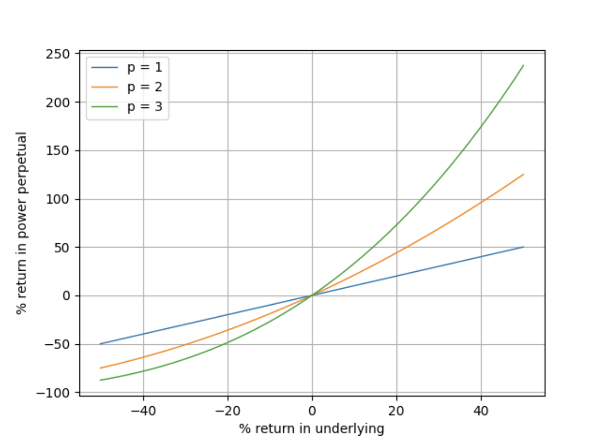
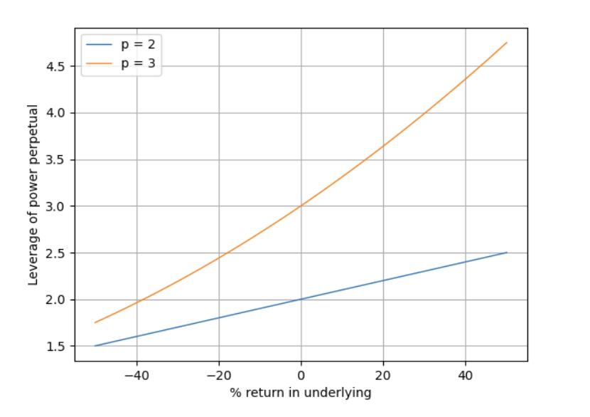
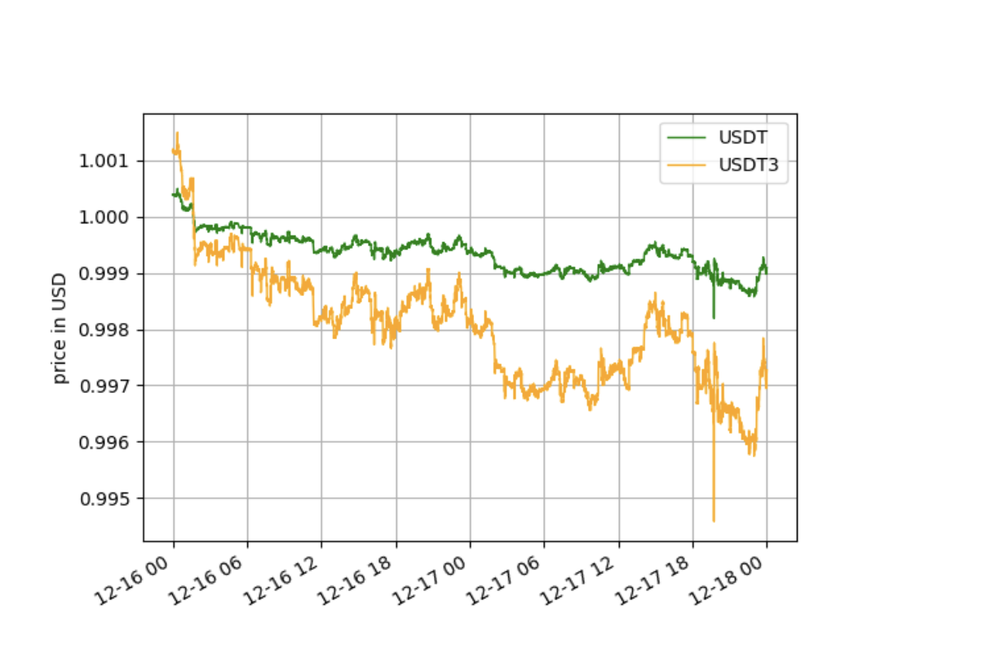

# Obsidian Protocol

# Power Derivatives for USDe and Stablecoins on Ethena Network for precise and superior hedging.

## Abstract

The Obsidian Protocol introduces a groundbreaking framework for trading and hedging stablecoin power derivatives, anchored on Ethena’s USDe³—a cubic power derivative of the USDe stablecoin. By amplifying even minor price fluctuations through a cubic transformation, USDe³ provides traders and liquidity providers with a robust toolset for advanced speculation, risk management, and hedging.

The protocol extends its utility to cross-stablecoin pairs, offering derivatives such as BTC⁴/USDe and ETH³/USDe, enabling traders to leverage amplified convexity on leading cryptocurrencies paired with stablecoins. These innovative derivatives create new opportunities for managing risk, executing arbitrage strategies, and enhancing market liquidity.

## Introduction to Power Derivatives

### Defining Power Derivatives

**A power derivative is a perpetual derivative indexed to a power p of the price of an underlying instrument**. Given a price x of an asset such as BTC, the theoretical value of the BTC power derivative is:

| BTCp=xp |
| :-----: |

Where:  
 p1  
 x \= price of the underlying instrument  
 p \= power

Under traditional pricing models, the price at which perpetual future is trading, called mark price, is kept in line with the index price xp through the funding fee mechanism. When the mark price surpasses the index price, long positions pay a funding fee to short positions. Conversely, if the index price exceeds the mark price, short positions must pay the funding fee to long positions.

- Longs pay shorts if **Mark price** \> **Index price**
- Shorts pay longs if **Index price** \> **Mark price**

An alternative funding fee approach, suitable for automated market makers (AMMs), decays user positions depending on which side holds more liability to the liquidity reserve. If long holders hold more valuable positions than short holders, longs pay funding fees to shorts and liquidity providers. Analogously, if shorts hold more value, they pay funding fees to longs and liquidity providers.

- Longs pay shorts if **Long Positions value** \> **Short Positions value**
- Shorts pay longs if **Short Positions** **value** \> **Long Positions value**

Both funding fee mechanisms incentivize traders to take positions that receive funding fees. In limit order book and concentrated liquidity markets, such behavior pushes the mark price closer to the index price, effectively reducing deviations. Existing power derivative AMM models track price through a price oracle while the funding mechanism serves only as a financial incentive to liquidity providers and contrarian traders.

Continuously funded power derivatives have **no expiration and provide positive convexity**. This means favorable price movements in the underlying asset yields greater positive returns compared to the absolute negative returns from equally sized unfavorable moves. In other words, power derivative holders earn more when the price moves in their favor and lose less when it moves against them.

For cases where p1, the power derivative return profile exhibits heightened sensitivity to the underlying return.  

**Figure 3**: The return of a power derivative vs the return of an underlying asset

As the return on the underlying asset rises above zero, the power derivative's return increases exponentially, effectively providing traders with built-in leverage. This unique characteristic distinguishes power derivatives from traditional leveraged products, as **traders can amplify their returns without exposing themselves to liquidation risk**. By design, the power derivative's value (xp) always remains positive, ensuring traders are shielded from liquidation, even during periods of extreme market volatility.

The absence of liquidation risk is the main advantage of power derivatives, making them particularly attractive to traders seeking to manage risk while still having the Obsidian for enhanced returns. This feature allows traders to maintain their positions through market turbulence, providing greater flexibility and control over their trading strategies. As a result, power derivatives offer a compelling alternative to traditional leveraged products, combining the Obsidian for amplified returns with a more robust risk management framework. This setup enables more efficient capital allocation when margin trading. The minimum leverage, approximately equal to power p, is experienced for small returns around 0\. Leverage increases exponentially with positive returns while diminishing with negative returns.  

**Figure 4**: The leverage of a power derivative vs the return in the underlying asset

Shorting perpetual futures is traditionally associated with collateral liquidation risk. To address this fundamental problem and eliminate liquidation risk, Obsidian Protocol introduces a novel bonding curve mechanism (to be announced in the implementation doc).

### **USDe³: The Core Hedging Product**

USDe³ is designed to maximize the utility of stablecoins in volatile and low-volatility conditions alike:

- **Core Functionality**: Captures minor price movements of USDe through a cubic transformation, significantly amplifying returns while mitigating losses.
- **Convex Returns**: A 1.005% increase in USDe results in a 3.045% return for USDe³:

```
rPP=(1+ 0.01005)^3 - 1
= 0.0345 or 3.0454%
```

Assuming USDe trades at 0.995, USDe3 would trade at 0.9850. A trader investing $10,000 into a USDe3 long position at $0.9850 would receive 10,151.51 USDe3 tokens. If USDelater trades at $1.005 and USDe3 at $1.015, the trader could cash out for $10,304.54, netting a $304.54 (**3.045%**) profit.

### USDT³: Example illustrating Stablecoin Fluctuations

The graph below compares the standard USDT price (green) with its cubic transformation, USDT³ over three days, illustrating the latter's pronounced response to market volatility.



Price of USDT vs USDT³ over 3 days

####

### Core Use Cases

- **Hedging**: Protect against short-term stablecoin volatility without exposure to liquidation risks.
- **Speculation**: Amplify gains on minor price changes in stablecoin markets.
- **Arbitrage**: Exploit pricing disparities across stablecoin derivatives and underlying assets.

###

## Strategic Use Cases

### **Speculative Trading**:

- Exploit micro-movements in USDe price to achieve exponential returns.
- Effective for short-term, high-frequency trading strategies.

### **Precision Hedging**:

- Use USDe3,USDe¹⁶ etc to hedge against minute fluctuations in stablecoin holdings or portfolios.
- Allows for highly targeted risk mitigation without collateral liquidation risks.

### **Market Making**:

- LPs in USDe3,USDe¹⁶ etc pools can benefit from extreme convex funding fees in volatile markets.

###

###

###

## Cross Derivative Pairs: BTC⁴/USDe, ETH³/USDe etc

### High-Leverage Trading with Convex Derivatives

The protocol introduces advanced cross-stablecoin markets, combining major cryptocurrencies like BTC and ETH with USDe stablecoin:

- **BTC⁴/USDe**: A quartic power derivative offering exponential exposure to Bitcoin’s price movements relative to USDe.
- **ETH³/USDe**: A cubic power derivative amplifying Ethereum's volatility against USDe.

### Customizable Convexity: Tailoring Risk and Return with Adjustable Power

A key feature allows users to customize the power p of their perpetual derivative to cater to diverse market participants. By selecting p, users can effectively tune position leverage and convexity according to their needs.

Such customization enables a wide range of power derivative products suitable for complex trading strategies, short-term speculative hedges, or simply vehicles for profit.

## No liquidations: Automatic deleveraging and position protection

Opening a long or short position through the Obsidian protocol doesn’t require collateral. Underlying assets are exchanged for tokens representing a position protected from reaching a negative value, ensuring liquidations never happen. The value of a long position can reach zero only if the underlying asset reaches zero. Analogous to this, the value of a short position can reach zero only if the underlying asset becomes infinity.

## Liquidity providers: Incentives and Protection

Liquidity pools set up on the protocol are designed to contain a single underlying asset. Such characteristics protect liquidity providers from ending up with excess inventory in assets they do not wish to hold. Although this often experienced issue is mitigated in our approach, liquidity providers can still experience losses. To compensate aforementioned risk liquidity providers receive compensation through funding fees. Additionally, continuous reference price adjustment mechanism continuously adjusts concentration of liquidity around the market price thus increasing the liquidity providers capital efficiency[^1]. Fee rates and reference price update parameters are set by pool operators or governed by pool DAO.

## Diverse Product Suite: From Hedging to Speculation

Obsidian Protocol offers a diverse suite of power derivative products catering to various trading objectives and strategies. Whether users seek to hedge against short-term market volatility, speculate on asset prices, or employ sophisticated algorithmic trading techniques, our platform provides the necessary tools and flexibility.

Through power derivative instruments with varying convexity levels, users can fine-tune their risk exposure and optimize their returns based on their market view and risk appetite. In essence, traders can execute their strategies with greater precision and efficiency.

## Power Pools: Permissionless Liquidity Provisioning

Power Pool (PP) is the core protocol component that enables the creation of power derivative markets in a fully permissionless manner. The pool creator can manage the pool and delegate management roles. Alternatively, the pool ownership is transferable to the pool DAO. For end users, PPs enable seamless DEX-style trading of power derivatives against underlying assets.

### Simple Pools: power derivatives

Simple Pools contain a single power derivative of a specified power (e.g., USDe3_USDe). These pools provide a straightforward way for liquidity providers to offer power derivative trading for individual assets.

### Composite Pools: Power Derivatives Families

Composite Pools contain a family of power derivative products (e.g., USDe3_USDe, USDe4_USDe, USDe5_USDe) sharing liquidity in the underlying asset. Composite Pools allow more efficient capital utilization and provide traders with multiple convexity options within a single pool.

## Future Roadmap: Expanding the Power Derivatives Frontier

Obsidian Protocol is committed to expanding its offerings and driving the adoption of power derivatives. The key milestones on our roadmap include:

### Key Milestones:

#### Q1 2025

- Launch USDe³/USD, USDe³/USDT, and USDe³/USDC perpetual markets.
- Introduce cross-stablecoin pair derivatives for arbitrage and hedging strategies.
- Begin testing USDtb³ power derivatives alongside USDe³.

#### Q2 2025

- Develop composite liquidity pools for enhanced capital efficiency.
- Automate trading and hedging strategies for USDe and USDtb derivatives.
- Launch stablecoin-focused power pools to support liquidity providers.

#### Q3 2025

- Establish DAO-governed perpetual pools for stablecoins.
- Expand into omnichain deployment for cross-chain trading of USDe and USDtb derivatives.
- Introduce governance mechanisms specific to stablecoin derivatives.

#### Q4 2025 and Beyond

- Incorporate real-world assets (RWAs) and advanced yield-bearing instruments into USDe and USDtb markets.
- Decentralize governance of cross-stablecoin derivatives.
- Collaborate with partners to launch structured products for USDe and USDtb markets.

## Why We Are Building on the Ethena Network

The Ethena Network provides the critical infrastructure and stablecoin design necessary to support the Obsidian Protocol’s vision for decentralized, scalable, and innovative financial products. By utilizing Ethena’s Ble Testnet and USDe, the protocol ensures high levels of stability, decentralization, and operational efficiency.

### Key Advantages of the Ethena Network:

- USDe Onboarding: Simplified integration of Ethena’s native stablecoin into DeFi applications.
- Sub-Second Block Times: Near-instant transactions provide seamless trading experiences.
- Economic Security Through Staking: A robust staking framework underpins the network's stability.
- Instant Finality with zk Proofs: Ensures transaction accuracy and security without delays.

These features allow the Obsidian Protocol to leverage USDe as a stable and versatile foundation for power derivatives like USDe³, enabling scalable financial innovation within a secure and efficient ecosystem.

[^1]: Liquidity concentration is not 1:1 compared with Uniswap. On Uniswap, users manage liquidity concentration manually while our model manages liquidity concentration automatically
