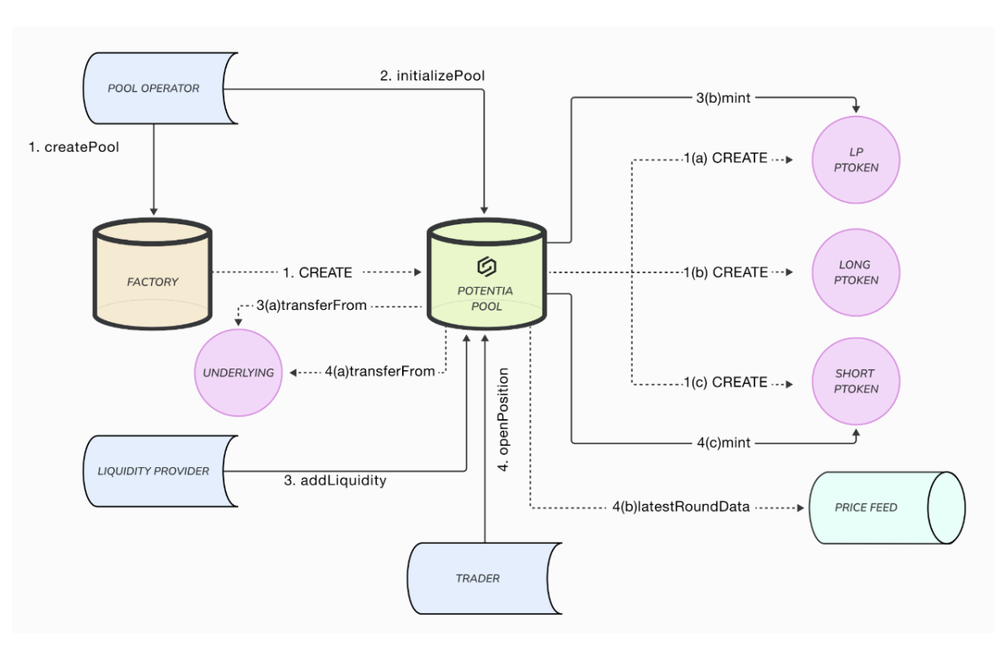

# Obsidian Protocol: Introducing USDe³ and Stablecoin Power Derivatives on Ethena Network

## 1 \- Abstract

Power derivatives represent a groundbreaking innovation in DeFi, offering continuous funding without the risk of Long-Short liquidation. The Obsidian Protocol pioneers power derivatives through its novel design, enabling decentralized and permissionless perpetual power derivatives.

We analyzed traditional pricing models for power derivatives alongside novel bonding curve automated market-making models. Insights from this research have informed improvements in these approaches, setting the stage for the launch of the Obsidian Protocol.

By providing leveraged long and short exposure without the risks of liquidation, traders can access maximum leverage with greater capital efficiency, while liquidity providers are rewarded for their contributions. The Obsidian Protocol is uniquely positioned to consolidate significant liquidity, bridging the gap between traditional options markets and DeFi into a single, capital-efficient instrument.

This litepaper primarily focuses on the infrastructure and ecosystem being built around power derivatives within the Obsidian Protocol. Stay tuned for in-depth technical details, implementation frameworks, and backtesting simulations in subsequent documentation post-mainnet launch.

##

## 2 \- Introduction to USDe³ and Power Derivatives

### 2.1 Defining Power Derivatives

A power derivative is a perpetual derivative indexed to a power pp of the price of an underlying instrument. In the case of the Ethena Network, the underlying instrument is the stablecoin USDe. The theoretical value of a power perpetual for USDe³ is:

$$USDe^p=x^p , p >= 1$$

Where:

- 𝑝 ≥ 1
- x= price of the underlying instrument
- p= power

The cubic relationship allows traders to gain amplified returns without requiring collateralized leverage, as the return profile is inherently convex. For example:

- Positive Price Movements: A small increase in USDe price results in exponential gains for USDe³.
- Negative Price Movements: Losses are less severe compared to traditional leveraged positions due to the nature of the cubic return function which are non-linear by design.

### 2.2 Pricing Models and Funding Mechanisms for USDe³

Under traditional perpetual futures models, the mark price (trading price of the derivative) is kept close to the index price (spot price of the underlying) using a funding fee mechanism:

- Longs pay shorts if the mark price \> index price.
- Shorts pay longs if the index price \> mark price.

For USDe³, this principle is further refined through an automated funding mechanism tailored for decentralized markets. The funding fee depends on the relative value of long and short positions in the liquidity pool:

- Longs pay shorts if the value of long positions \> short positions.
- Shorts pay longs if the value of short positions \> long positions.

This approach ensures market balance by incentivizing traders automatically without the need of separate mark and index prices. .

### 2.3 Positive Convexity: The Advantage of USDe³

Power perpetuals like USDe³ offer built-in leverage through positive convexity:

1. Exponential Gains: Favorable price movements in USDe result in exponentially higher returns for USDe³.
2. Mitigated Losses: Adverse price changes result in smaller proportional losses, compared to traditional leverage.
3. No Liquidation Risk: Unlike margin-based products, positions in USDe³ cannot be liquidated due to the inherent design of power perpetuals. The cubic transformation ensures that returns always remain above zero.

For example:

- If USDe moves from $0.995 to $1.005 (+1% change), the return on USDe³ is:

$$r_{PP}=(1+ 0.01005)^3-1= 0.0345=3.0454%$$

This characteristic makes USDe³ a powerful tool for traders seeking leveraged exposure with controlled risk.

### 2.4 Market Applications for USDe³

The unique properties of USDe³ enable several use cases:

1. Speculative Trading: Traders can capitalize on small price movements in USDe with amplified returns.
2. Hedging Strategies: Use USDe³ to hedge against volatility or de-pegging risks in stablecoin markets.
3. Arbitrage Opportunities: Exploit mispricings in USDe³ markets relative to the underlying spot price of USDe.

By leveraging the Ethena Network’s instant finality with zk proofs, sub-second block times, and economic security through staking, USDe³ markets can achieve unparalleled speed, reliability, and scalability.

##

## 3 \- Protocol Design

Obsidian is an Automated Market Maker (AMM) that utilizes an asymptotic bonding curve, distinguishing itself from traditional decentralized exchanges like Uniswap. The key innovation lies in its automated liquidity management, which removes the need for liquidity providers (LPs) to manually adjust their positions within specific price ranges. This automation streamlines the liquidity provision process, offering a more hands-off automated experience for LPs.

Key Features

1. Automated Liquidity Concentration: Unlike Uniswap, where LPs need to constantly manage their liquidity positions, Obsidian automates this process. This ensures optimal liquidity distribution to mid-points without any manual intervention.

2. Adjustment Parameters (α\\alpha and β\\beta): Each Obsidian Pool is governed by two parameters:

   - α\\alpha: Adjusts the long payoff.
   - β\\beta: Adjusts the short payoff. These parameters are set during pool deployment and dynamically adjusted based on pool interactions.

3. Separate Bonding Curves for Long and Short Positions:

   - Long Payoff (ϕ(x)\\phi(x)): Represents the payoff for long positions.
   - Short Payoff (ψ(x)\\psi(x)): Represents the payoff for short positions. Here, xx is the normalized price of the underlying asset, rr is the pool reserves, and kk is the pool power.

4. Position Management via PTokens:

   - Positions are tokenized using ERC20 tokens called PTokens.
   - There are three types of PTokens:
     - LpPToken: Represents liquidity provider positions.
     - LongPToken: Represents long positions.
     - ShortPToken: Represents short positions.
   - When a position is opened, the appropriate amount of PTokens is minted and transferred to the position creator.

5. No Discrete Positions:

   - Obsidian maintains aggregated positions rather than individual ones.
   - Traders can adjust their positions by trading PTokens, allowing for partial or full position management.

Position Value Calculation

To determine the value of positions at any given time tt:

1. Parameters:

   - Current Long Payoff (Φ\\Phi)
   - Current Short Payoff (Ψ\\Psi)
   - Amount of LongPTokens held (LongPTokenaccount\\{LongPToken}\_{\\t{account}})
   - Amount of ShortPTokens held (ShortPTokenaccount\\{ShortPToken}\_{\\t{account}})
   - Total LongPTokens in circulation (LongPTokentotal\\{LongPToken}\_{\\{total}})
   - Total ShortPTokens in circulation (ShortPTokentotal\\{ShortPToken}\_{\\{total}})

2. Calculations:

   - Long Position Value (LPV): $LPV=\frac{Φ×LongPToken_{account}}{LongPToken_{total}}$
   - Short Position Value (SPV): $SPV=\frac{Ψ×ShortPToken_{account}}{ShortPToken_{total}}$

3. Conversion to Base Currency (ETH\\{ETH} or others):

   - Obtain the current exchange rate (xx) from ObsidianPool.sol.
   - Convert the position values:
     - LPV in Base Currency: $LPV_{base}=LPV_{base}.x$
     - SPV in Base Currency: $SPVbase=SPV_{base}.x$

Example of Minting LongPTokens

When adding ΔR\\Delta R to open a long position:

- If there are no LongPTokens in circulation: `mint(msg.sender,ΔR)`{mint}(\\text{msg.sender}, \\Delta R)
- If LongPTokens are already in circulation: `mint(msg.sender, longSupply*ΔR/Φ)`
  - Where longSupply is the total LongPTokens in circulation.
  - msg.sender is the account opening the long position.
  - Φ\\Phi is the current long payoff.

Distinctive Approach to Bonding Curves

Obsidian's use of separate bonding curves for long and short positions is a significant departure from traditional AMMs that use a single curve. This dual-curve system allows for more nuanced management of market dynamics and provides traders with clearer insights into their potential payoffs.

Advantages Over Traditional Platforms

- Simplified Liquidity Provision: Automation reduces the complexity for LPs, making the platform more accessible.
- Enhanced Position Management: Tokenization of positions through PTokens allows for seamless trading and adjustment of positions.
- Dynamic Adjustments: The adjustment parameters α\\alpha and β\\beta enable the protocol to respond dynamically to market conditions.

##

## 4 \- Architecture

### Obsidian Factory

The Obsidian Factory is a smart contract factory used to deploy Obsidian Pools. Pool Operators (POs) can invoke the createPool function on ObsidianFactory.sol to deploy pools with any specified power kk. For example, creating a pool with the underlying asset WBTC and k=2k \= 2 will deploy an Obsidian Pool that tracks WBTC2\\{WBTC}^2.

### Obsidian Pools

Once deployed with a specific power kk, an Obsidian Pool tracks the price of the underlying asset raised to that power. For instance, a pool with k \= 3 will track the price of the CRV asset cubed. Traders can open long or short positions on this pool, effectively taking positions on the derivative CRV3\\{CRV}^3.

### PTokens

Unlike other derivative systems where positions are represented by a unique one-to-one mapping between the trader and the position, Obsidian Pools track user positions through ERC20 tokens known as PTokens. This approach is in stark contrast to how Central Limit Order Books (CLOBs) maintain and register unique positions. Each time a new position is opened, the pool's specific PTokens are minted. Every pool has three types of PTokens:

- LpPToken: Minted and transferred to Liquidity Providers (LPs) when they add liquidity.
- LongPToken: Minted and transferred to traders when they open long positions.
- ShortPToken: Minted and transferred to traders when they open short positions.

Note: Each set of PTokens is specific to its pool, meaning every pool has its own unique PTokens.

### Price Feed

Obsidian Pools use price feeds to track the price of the underlying asset. We incorporate Chainlink oracles(Expanded to uniswap and redstone with testnet upgrade by 2024 end and more price feeds in Q1’25) to continuously monitor the market price, ensuring accurate and up-to-date information.

## 5 \- Protocol Features

1\. No Liquidations

Users gain access to leveraged exposure without the risk of Long and Short liquidation. Obsidian maintains value even during extreme market volatility.

- Long positions have zero value only if the underlying asset price drops to zero.
- Short positions have zero value only if the underlying asset price rises to infinity.
- If the price reverts from zero or infinity, the tokens representing the positions regain positive value; therefore, positions are never liquidated.

---

2\. Amplified Gains & Mitigated Losses

Obsidian exhibits positive convexity, meaning favorable price movements yield greater positive returns compared to the absolute negative returns from equally sized unfavorable moves.

Let's compare the risk-return profile of 5x leverage with x1.5x^{1.5}, a power derivative on Obsidian DEX:

Scenario 1: The Price of BTC Increases by 20%

- 5x Leverage: 100% profit
- x1.5x^{1.5}: Approximately 148% profit

Scenario 2: The Price of BTC Decreases by 20%

- 5x Leverage: 100% loss (leading to liquidation)
- x1.5x^{1.5}: Approximately 67% loss

Conclusion:

- A 20% increase in the underlying asset price (BTC) results in a 148% return.
- A 20% decrease in the underlying asset price (BTC) results in a 67% loss.

---

3\. No Strikes or Expirations

Crypto options markets are often fragmented across multiple strike prices and expiration dates, leading to inefficient capital utilization.

Obsidian addresses this issue by providing continuous exposure without expiration dates. The absence of strikes or expirations helps consolidate liquidity from fragmented options markets into a single, efficient instrument.

---

4\. Create Low-Cost Power Pools

Obsidian enables liquidity providers to create and manage power perpetual liquidity pools in a permissionless environment.

Users can create low-cost pools in under a minute on Obsidian DEX.

---

5\. Trade Power Pools

Users can trade existing power pools on Obsidian DEX. These pools can be either:

- Simple Pools: Pools with a single power perpetual asset, e.g., x2x^2.
- Composite Pools: Offer a variety of convexity options with multiple powers within a single pool, e.g., x2x^2, x3x^3.

---

6\. No Impermanent Loss for Liquidity Providers

Simple pools and composite pools help liquidity providers avoid impermanent loss—the loss associated with providing liquidity.

LPs are required to deposit only a single asset into the LP pool instead of a pair of assets, which helps them allocate capital efficiently while avoiding impermanent loss.

## 6 \- Why We Are Building on the Ethena Network

The Ethena Network provides the critical infrastructure and stablecoin design necessary to support the Obsidian Protocol’s vision for decentralized, scalable, and innovative financial products. By utilizing Ethena’s Ble Testnet and USDe, the protocol ensures high levels of stability, decentralization, and operational efficiency.

#### Key Advantages of the Ethena Network:

- USDe Onboarding: Simplified integration of Ethena’s native stablecoin into DeFi applications.
- Sub-Second Block Times: Near-instant transactions provide seamless trading experiences.
- Economic Security Through Staking: A robust staking framework underpins the network's stability.
- Instant Finality with zk Proofs: Ensures transaction accuracy and security without delays.

These features allow the Obsidian Protocol to leverage USDe as a stable and versatile foundation for power derivatives like USDe³, enabling scalable financial innovation within a secure and efficient ecosystem.

##

## 7 \- Future Roadmap: Expanding our Protocol

The Obsidian Protocol is committed to advancing its ecosystem by focusing on USDe³ power derivatives and expanding cross-stablecoin pair derivatives. This roadmap outlines the key milestones for scaling USDe³/USD, USDe³/USDT, USDe³/USDC, and incorporating USDtb, another Ethena stablecoin, into its innovative derivative suite.

### Key Milestones:

#### Q1 2025

- Launch USDe³/USD, USDe³/USDT, and USDe³/USDC derivative markets.
- Introduce cross-stablecoin pair derivatives for arbitrage and hedging strategies.
- Begin testing USDtb³ power derivatives alongside USDe³.

#### Q2 2025

- Develop composite liquidity pools for enhanced capital efficiency.
- Automate trading and hedging strategies for USDe and USDtb derivatives.
- Launch stablecoin-focused power pools to support liquidity providers.

#### Q3 2025

- Establish DAO-governed perpetual pools for stablecoins.
- Expand into omnichain deployment for cross-chain trading of USDe and USDtb derivatives.
- Introduce governance mechanisms specific to stablecoin derivatives.

#### Q4 2025 and Beyond

- Incorporate real-world assets (RWAs) and advanced yield-bearing instruments into USDe and USDtb markets.
- Decentralize governance of cross-stablecoin derivatives.
- Collaborate with partners to launch structured products for USDe and USDtb markets.
