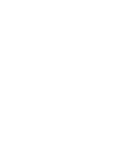

<div align="center">
  
  <h1>genie-interface</h1>
    <a href="https://twitter.com/intent/tweet?text=Wow:&url=https%3A%2F%2Ftwitter.com%2FSquaredLabs_"></a>
  <h4>
    <a href="https://genie.squaredlabs.io/">https://genie.squaredlabs.io/</a>
  </h4>
</div>

Genie is SquaredLabs' decentralized exchange (DEX) designed to facilitate the trading of pools from Potentia without the risk of liquidation.

## How to setup a development environment?
1. Clone the repo:
```bash
git clone https://github.com/SquaredLab-io/genie-interface.git
```

2. Install the dependencies:
```bash
cd genie-interface
npm i
```

3. Create `.env.local` and add environment variables.

4. Run the development server:
```bash
npm run dev
```

## How to get in touch?
SquaredLabs' team is active and open to questions on our [Telegram group](https://t.me/squaredlabs).

<!-- ## Contributing
We welcome contributions to `genie-interface`! Please review our [contributing guidelines](CONTRIBUTING.md) for more information. -->

<!-- ## License

`genie-interface` is open source software licensed under the Apache 2.0 license. -->
